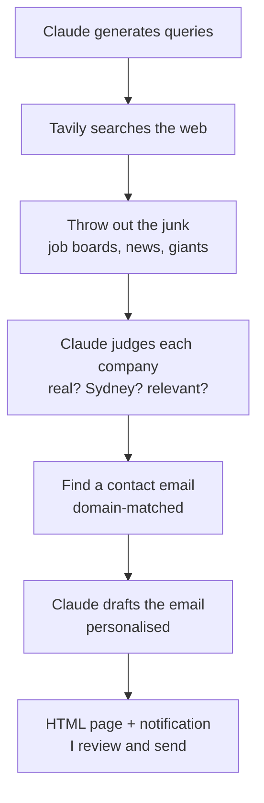

# AI Job Search Agent

Hey there :) Nick here.

I'm a final-year student on the hunt for an internship, and let's be real — job hunting is *painful*. Between coursework, activities, and life, who actually has time to sit there googling companies one by one and writing the same email over and over?

So I figured: why not build an AI agent that quietly solves this for me on the regular? Bonus points if it also shows a future employer (fingers crossed 🤞) that instead of just complaining about the grind, I actually built something to fix it.

## What it actually does



The purpose of this design isn't to spam my resume to as many companies as possible. It's to cut down the hours I'd otherwise spend hunting for companies and digging up their contact emails — the boring, repetitive part. The agent handles the grunt work so I can spend my actual attention on the part that matters: reviewing each company, deciding if it's a genuine fit, and writing back like a human when someone replies.

Quality over quantity. The bottleneck in a job hunt was never "how fast can I send emails" — it was "how do I find the right places to send them without burning a whole afternoon." That's what this fixes.

## The stack

- **Python** — the glue
- **Claude API** — the "brain": comes up with queries, judges companies, writes the emails
- **Tavily API** — the "eyes": searches the web
- **Windows Task Scheduler** — so it quietly runs itself every weekday morning while I'm still asleep

## Cost

I put **$5 USD** on the Claude API to get started. Testing and debugging burned through about **$1**, and each actual run costs me roughly **$0.05–0.10** — so that $5 stretches a long way (we're talking dozens of runs).

I went with Claude's Haiku model on purpose — it's cheap, fast, and more than good enough for "is this a real Sydney company?" and "write a short email." No need to pay for the heavy models here.

That said, **you don't have to use the Claude API.** The "brain" is swappable — you could plug in a free alternative like Groq (free tier, runs open models like Llama) or any other LLM API. You'd just need to adjust the API calls in `Main.py` and `draft_emails.py`. Same goes for Tavily — it has a free tier (1,000 searches/month), which is plenty for personal use.

Basically: this whole thing can run for the price of a coffee, or free if you're willing to wire up the free-tier alternatives.

## How the pieces fit

| File | What it's for |
|------|---------------|
| `Main.py` | The main event: search → filter → find email → draft |
| `draft_emails.py` | Writes the emails (and skips anyone I've already pestered) |
| `mark_applied.py` | I run this after sending — asks "did you send this?" and tracks the yeses |
| `render_drafts.py` | Makes the drafts look nice in HTML + pings a notification |

## How it remembers stuff

A bunch of JSON files so it doesn't keep showing me the same companies over and over (learned that one the hard way):

- `seen_companies.json` — URLs it's already looked at
- `seen_names.json` — company names it's seen (because the same company loves showing up under five different links)
- `applied_companies.json` — who I've already emailed, so they don't come back
- `companies_ready.json` — the master list of companies that passed the vibe check
- `drafts.json` — emails waiting for me to review

## Getting it running

1. Clone it and set up the environment:
   ```bash
   python -m venv .venv
   .venv\Scripts\activate
   pip install tavily-python anthropic python-dotenv plyer
   ```

2. Make a `.env` file with your keys (don't commit this, obviously):
   ```
   TAVILY_API_KEY=your_tavily_key
   ANTHROPIC_API_KEY=your_anthropic_key
   ```

3. Go:
   ```bash
   python Main.py          # finds companies + drafts emails
   python mark_applied.py  # run after you've sent some
   ```

## A few decisions

- **Cheap filter first, then Claude** — there's a blocklist that throws out obvious junk (Google, Seek, news sites) before paying for an API call. No point asking Claude "is google.com a small Sydney startup?"
- **Email domain matching** — it only trusts an email if the domain matches the company's actual website. This stopped it from once confidently handing me a *high school's* email address. We don't talk about that.
- **Human stays in the loop** — drafting = automated, sending = me. And nothing counts as "applied" until I say I actually sent it.

## Known issues (aka the honesty section)

- Finding emails is hit-or-miss. No public email = it tells me to find it myself.
- Sometimes a fake placeholder email like `john.doe@` sneaks past. Rude.
- The name-deduplication could in theory merge two different companies with similar names. Hasn't bitten me yet. Yet.
- All this JSON juggling is getting silly — might move it to a proper SQLite database one day.
- Want to add follow-up reminders for companies that ghost me.

## Why I bothered

Two reasons, honestly. One: the job hunt was genuinely tedious and I wanted it to stop eating my evenings. Two: I'm studying this stuff — LLMs, APIs, automation — and there's a big difference between doing it for an assignment and building something you actually use. This one I actually use. It's not perfect, but it turned a soul-draining manual grind into a single command, and I learned a ton wiring it all together.
