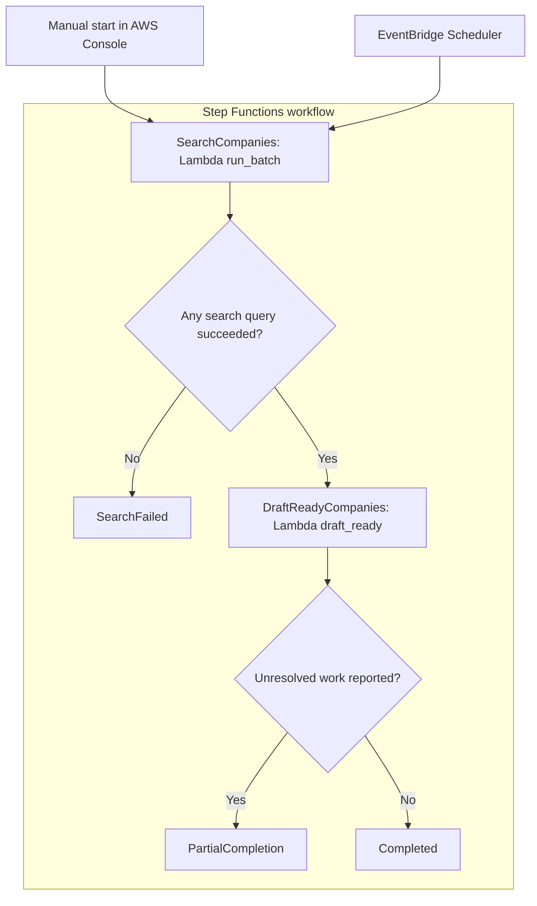
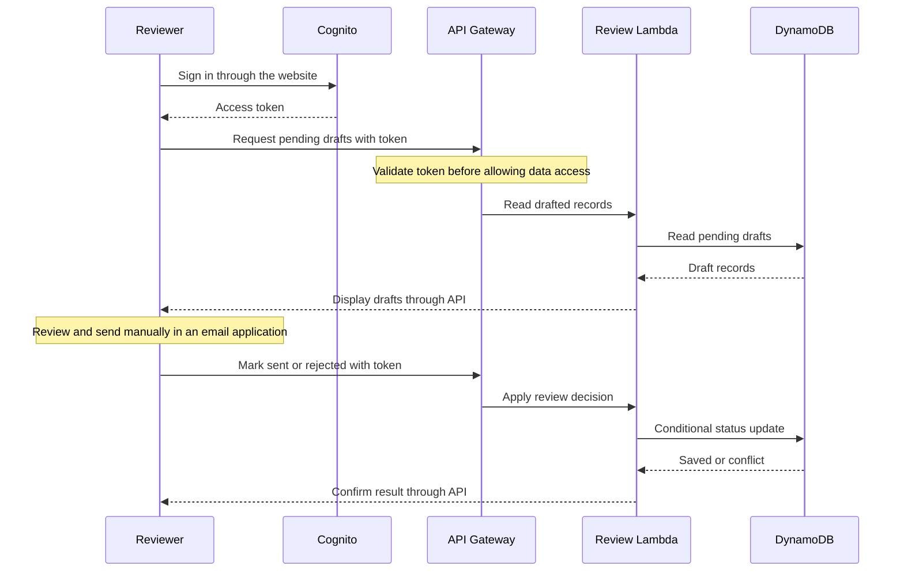

# AWS Serverless Internship Outreach Agent

A personal Python project that finds potential internship targets in Sydney, screens companies with Claude, prepares outreach drafts, and keeps application records. The AWS version adds cloud execution, a shared DynamoDB database, and a browser-based review interface.

**Email sending stays manual.** The agent prepares drafts; I decide whether to apply and send the message myself.

> **Repository status:** The Python files currently published here are the original local version. The AWS workflows and review website described below have been deployed in my personal account, but their deployment templates and updated source files have not yet been added to this repository. The first section is a reference for operating that existing deployment, not a fresh-install guide. This README update does not deploy or change any AWS resources.

## Start here: my AWS operating procedure

### Run the search and drafting workflow once

1. Sign in to the AWS Console and select **Sydney (`ap-southeast-2`)**.
2. Open **Step Functions → State machines** and select the agent workflow containing `SearchCompanies` and `DraftReadyCompanies`.
   - If you cannot identify it, open **CloudFormation → `internship-agent-worker-stack` → Outputs** and find `WorkflowArn`. Match that ARN to the state machine.
3. Select **Start execution**, keep the generated execution name, and replace the input with:

   ```json
   {}
   ```

4. Select **Start execution** once. This makes real Tavily/Claude requests and can save company records and drafts to DynamoDB.
5. Wait for the execution to finish, then open **Execution input and output → Output**.
6. Review the counts below before moving to the review website.

The deployed workflow is configured for **3 search queries**, **10 results per query**, **at most 5 companies processed**, and **at most 5 ready companies drafted** per execution. These values are set in the state machine definition; adding different limits to the `{}` input does not override them in this version.

| Output field | What it tells me |
| --- | --- |
| `search.queries_succeeded` | Number of search queries that completed |
| `search.candidates_found` | Candidate URLs found before the company processing limit |
| `search.companies_processed` | Companies actually processed in this batch |
| `search.counts.saved` | Records saved; these are not necessarily all suitable outreach targets |
| `search.counts.retryable` | Companies whose processing remains unresolved |
| `search.counts.error` | Company processing errors reported by the batch |
| `search.unprocessed_urls` | Candidates left outside this batch |
| `drafts.counts.drafted` | Drafts created in this execution |
| `drafts.counts.retryable` / `drafts.counts.error` | Unresolved or failed drafting work |
| `drafts.emails_sent` | Should be `0`; the workflow does not send emails |
| `summary.outcome` | `completed` or `partial` for executions that reach a summary |

**A green `Succeeded` execution means the workflow finished, not that every company passed screening or produced a draft.** `PartialCompletion` is a deliberate outcome for unresolved work. A run with zero new drafts can also be valid: there may be no eligible `ready` records.

`company_limit` means the configured batch size was reached. It is not an error by itself. Remaining URLs are reported, but this version does not automatically queue them for continuation. Drafting can pick up previously saved `ready` companies as well as companies found in the current run.

### Review drafts in the browser

1. Open the bookmarked review website and sign in with the **Cognito review account**.
   - To find the URL again: **CloudFormation → `internship-agent-review-web` → Outputs → `WebsiteURL`**.
   - CloudFormation is only needed to locate the URL; normal review does not require the AWS Console or local Python.
2. Select **重新整理 / Refresh** inside the page to load the latest `drafted` records.
3. Check the company, recipient, subject, and message. Confirm that claims about my experience, availability, and internship preferences are accurate.
4. Choose the appropriate action:

| Website action | What happens |
| --- | --- |
| **開啟電郵草稿 / Open email draft** | Opens the configured email application with the recipient, subject, and body. I edit and send it myself. |
| **複製內容 / Copy content** | Copies the message so I can paste it into webmail and edit it. |
| **已寄出／已申請 / Already sent or applied** | After confirmation, records `sent` in DynamoDB. Use this only after actually sending or applying. |
| **唔申請 / Reject** | After confirmation, records `rejected` and removes the draft from the pending list. |
| **Leave it untouched** | Keeps the draft for a later review. |

The pending count is the accumulated backlog, not the number of drafts generated today. Marking a draft updates AWS immediately; if the underlying record has changed, the website asks me to refresh instead of overwriting it.

**First login:** Create the review user in the deployed Cognito user pool, use the temporary password, then set a new password when prompted. This is a separate website account. The page keeps the access token in memory; reloading the entire page requires signing in again, and the configured token lifetime is 15 minutes. Bookmark the website with **Ctrl + D** for later use.

### Check the daily schedule

The deployed scheduling template defaults to **09:00 every day in `Australia/Sydney`**, with the flexible time window disabled.

1. Find `ScheduleName` and `ScheduleGroup` in the worker stack's **Outputs**.
2. Open **Amazon EventBridge → Scheduler → Schedules** and select that schedule.
3. Check that it is **Enabled**, targets the intended Step Functions workflow, and has the expected time and timezone.
4. After a scheduled time passes, check that workflow's **Executions** for a corresponding new run and inspect its output.

Manual executions have been observed. Confirmation that the daily schedule fires automatically is still an operational check to complete; a successful manual run alone does not establish that.

### If a run is partial or fails

- For **`partial`**, inspect the search and drafting counts, then select the affected task in the graph and inspect its **Output**.
- For a failed task, open its error details. Use its Lambda/CloudWatch links to find the matching request and error message.
- Preserve the output and relevant error before deciding whether to rerun. An unchanged parsing or screening problem may recur on the next attempt.
- Return to the website and refresh to review any drafts that were successfully saved. Partial runs can still produce useful results.

## Why I built this

Hey, Nick here. I'm a Master of Data Science student at UNSW Sydney, graduating in November 2026.

Looking for internships meant repeatedly searching for companies, checking whether they were relevant, finding a contact address, and writing a similar introduction. I built the original Python agent to reduce that repetitive work while keeping the actual application decision with me.

I then moved the workflow to AWS to gain practical cloud experience: running Python outside my laptop, storing state in a database, coordinating tasks, managing permissions and secrets, and building an authenticated review interface. The goal is a useful personal tool and a project I can explain and improve, rather than just a cloud architecture diagram.

## How the AWS workflow works


```mermaid
flowchart TD
    Manual["Manual start in AWS Console"] --> Search["SearchCompanies: Lambda run_batch"]
    Schedule["EventBridge Scheduler"] --> Search
    subgraph Workflow["Step Functions workflow"]
        Search --> CheckSearch{"Any search query succeeded?"}
        CheckSearch -->|No| Failed["SearchFailed"]
        CheckSearch -->|Yes| Draft["DraftReadyCompanies: Lambda draft_ready"]
        Draft --> CheckResults{"Unresolved work reported?"}
        CheckResults -->|Yes| Partial["PartialCompletion"]
        CheckResults -->|No| Complete["Completed"]
    end
```

Step Functions coordinates these stages. During search, the worker uses Tavily to retrieve evidence and Claude to assess company identity, Sydney presence, business relevance, company size, and student fit. It attempts to find a contact address and saves the resulting state in DynamoDB.

The drafting stage reads eligible `ready` records, asks Claude to prepare personalised messages, and saves them as `drafted`. Both stages use the same worker Lambda with different actions. Infrastructure or invocation failures can stop the execution before it reaches either summary state; the diagram shows the normal decision paths.

## How browser review works


```mermaid
sequenceDiagram
    participant User as Reviewer
    participant Auth as Cognito
    participant API as API Gateway
    participant Review as Review Lambda
    participant DB as DynamoDB
    User->>Auth: Sign in through the website
    Auth-->>User: Access token
    User->>API: Request pending drafts with token
    Note over API: Validate token before allowing data access
    API->>Review: Read drafted records
    Review->>DB: Read pending drafts
    DB-->>Review: Draft records
    Review-->>User: Display drafts through API
    Note over User: Review and send manually in an email application
    User->>API: Mark sent or rejected with token
    API->>Review: Apply review decision
    Review->>DB: Conditional status update
    DB-->>Review: Saved or conflict
    Review-->>User: Confirm result through API
```

The review Lambda also serves the HTML page through API Gateway. This version does not need a separate S3 website or CloudFront distribution. The login page contains no private draft data; reading drafts and changing their status require authentication.

## What each service does

| Component | Role in this project |
| --- | --- |
| **Python** | Search, screening, state handling, drafting, and review backend logic |
| **Tavily API** | Retrieves company websites and supporting search evidence |
| **Claude API** | Screens companies and generates outreach drafts |
| **Lambda worker** | Runs `healthcheck`, `process_company`, `run_batch`, and `draft_ready` actions |
| **Step Functions** | Runs search and drafting in sequence and reports completion or partial completion |
| **EventBridge Scheduler** | Configured to start the workflow on a daily schedule |
| **DynamoDB** | Stores company records, drafts, and application status in `agent-applications` |
| **SSM Parameter Store** | Stores Claude/Tavily API keys as encrypted `SecureString` parameters |
| **S3** | Stores packaged worker code and dependencies used for deployment |
| **CloudFormation** | Defines the worker, workflow, scheduler, review application, and associated infrastructure |
| **Cognito** | Manages the private review website's user accounts and login |
| **API Gateway** | Provides the HTTPS review endpoint and validates tokens for data operations |
| **Review Lambda** | Serves the web page, reads drafts, and conditionally updates review decisions |
| **IAM** | Grants each AWS component the permissions needed for its role |
| **CloudWatch Logs** | Provides execution logs for diagnosing worker and review errors |

## How the agent remembers progress

The AWS version uses one DynamoDB record per company domain. A saved record can include company information, screening evidence, an email address, a draft, timestamps, and its current status.

| Status | Meaning |
| --- | --- |
| `discovered` | Company record saved, but it has not passed the complete readiness check |
| `ready` | Passed the configured screening gates and is eligible for drafting |
| `drafted` | A draft is saved and waiting for human review |
| `sent` | I have recorded that I sent the email or completed an application |
| `rejected` | I decided not to proceed with the draft |

`retryable` is a processing outcome, not one of these saved lifecycle statuses. It means the agent could not finish the assessment or operation confidently. It does not mean an automatic retry is scheduled.

Domain-based deduplication and conditional writes help prevent duplicate records. Draft creation checks that the record is still eligible before writing. Review decisions check the displayed version and update only the relevant status fields, preserving other company information.

An existing `discovered` record does not automatically become `ready` merely because another batch is run. Reassessment of unresolved or previously saved records remains an area for improvement.

## From the laptop version to AWS

| Area | Original local version | Deployed AWS version |
| --- | --- | --- |
| Execution | Python processes on my laptop | Lambda functions |
| Scheduling | Windows Task Scheduler | EventBridge Scheduler |
| Coordination | Python calls between scripts | Step Functions search and drafting tasks |
| State | Several JSON files | DynamoDB |
| API keys | Local `.env` | SSM Parameter Store |
| Review | Local HTML and terminal prompts | Authenticated browser interface |
| Deployment | Install Python packages locally | CloudFormation and Lambda deployment artifacts |
| Email sending | Manual | Manual |

A Lambda deployment ZIP contains application code and compatible dependencies. S3 holds the deployment artifact; Lambda runs the deployed code. CloudFormation applies the resource configuration and the selected artifact reference. Older ZIP objects can remain in S3 without all of them running at the same time.

## Run the original local version in this repository

These instructions apply to the checked-in local scripts. They do not create or invoke the AWS deployment described above.

In Windows PowerShell:

```powershell
git clone https://github.com/nicktang0307/internship-ai-job-search-agent.git
cd internship-ai-job-search-agent
python -m venv .venv
.\.venv\Scripts\Activate.ps1
python -m pip install tavily-python anthropic python-dotenv plyer
```

Create a local `.env` file:

```dotenv
TAVILY_API_KEY=your_tavily_key
ANTHROPIC_API_KEY=your_anthropic_key
```

Then run:

```powershell
python Main.py
python mark_applied.py
```

`Main.py` searches and screens companies, then calls the draft generator and HTML renderer. Run `mark_applied.py` to review and record what you have already sent. These commands make real API requests; keep API keys and personal generated state out of Git.

| Published file | Purpose |
| --- | --- |
| [`Main.py`](Main.py) | Local company discovery, screening, email lookup, and calls to drafting/rendering |
| [`draft_emails.py`](draft_emails.py) | Generates local outreach drafts |
| [`render_drafts.py`](render_drafts.py) | Produces a local HTML review page |
| [`mark_applied.py`](mark_applied.py) | Records manual application decisions |

The local version stores progress in files such as `seen_companies.json`, `seen_names.json`, `tried_topics.json`, `applied_companies.json`, `companies_ready.json`, and `drafts.json`. These are separate from the AWS database.

## Current results and limitations

The personal AWS deployment has demonstrated batch searching, saving company records, generating and saving a draft, and running the combined Step Functions workflow. A separate review website has been deployed with Cognito login. Recent workflow executions have reached `PartialCompletion`, so this is a working first version with known gaps, not a claim that every candidate is processed successfully.

- **Screening can be too strict.** A company can look suitable to the model but fail an evidence-validation rule, such as the Sydney-location check.
- **Some responses remain unresolved.** Model output parsing and website-owner checks have produced `retryable` outcomes.
- **Search quality varies.** Directories and irrelevant pages can still appear among candidates.
- **Email discovery is imperfect.** Addresses and generated statements require human checking; a plausible address is not proof of deliverability.
- **Batches are bounded.** A `completed` summary covers the configured batch, not all candidate URLs or all ready records in the database.
- **Daily automation still needs observed confirmation.** The schedule is configured, but manual execution success does not prove scheduled delivery.
- **The review page is intentionally small.** It lists pending drafts and records decisions. Editing happens in the email application; there is no in-page draft editor or application-history dashboard yet.
- **Review reads use a paginated table scan.** This is suitable for the current personal dataset; a larger workload would benefit from a more targeted access pattern.
- **AWS source publication is pending.** Updated worker code, templates, and web review source need to be organised into the repository before others can reproduce the cloud deployment from a clone.

## Costs

Costs come from Claude/Tavily usage and the AWS services involved in execution, storage, logging, and authentication. They vary with the number of runs, retrieved pages, model usage, and account pricing or allowances.

The earlier estimate of roughly USD 0.05–0.10 per run was an observation from the local Claude-based prototype, not a measured total for the AWS system. I have not established a reliable all-in cloud cost per run yet.

## What I learned and what comes next

This project gave me practical experience packaging Python for Lambda, moving state from JSON to DynamoDB, coordinating tasks with Step Functions, separating credentials from code, and connecting an authenticated web interface to a backend. Debugging partial executions also taught me to distinguish infrastructure success from useful application results.

Next improvements are to publish a reproducible AWS deployment, confirm scheduled runs, improve evidence checks, and add a deliberate way to revisit unresolved companies. Automated sending is not part of the current workflow.

## References

- [Step Functions execution details](https://docs.aws.amazon.com/step-functions/latest/dg/concepts-view-execution-details.html)
- [API Gateway JWT authorizers](https://docs.aws.amazon.com/apigateway/latest/developerguide/http-api-jwt-authorizer.html)
- [Creating Cognito users](https://docs.aws.amazon.com/cognito/latest/developerguide/how-to-create-user-accounts.html)

## License

[MIT](LICENSE)
